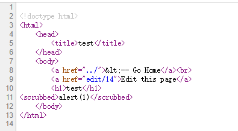
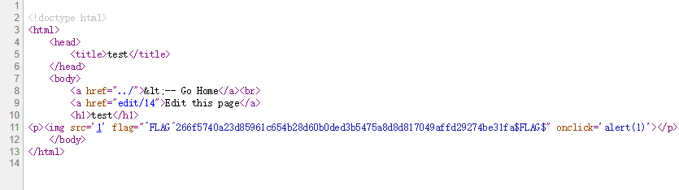

# Micro CMS v1

<b>Notice: the key numbers mentioned may be variable.</b>

```
.
├── (homepage）
└── page/
    ├── 1 (Testing)
    ├── 2 (Markdown Test)
    ├── 3 (?)
    ├── ...(?)
    ├── 10 (?)
    ├── 11 (the first page you created)
    ├── create
    └── edit/
          ├── 1 (Testing)
          ├── 2 (Markdown Test)
          ├── 3 (?)
          ├── ...(?)
          ├── 10 (?)
          └── 11 (the first page you created)        
```
## 1st flag

It's noticeable that the serial number 3-10 are skipped when we created new pages.
When it comes to /page/edit/7, the 1st flag can be found.

## 2nd flag

Make an assumption that the serial number in the URL is an injection point. (By handling the serial number, the assigned page will be provided to us)
Try an simple SQL injection example:  (skipped)page/edit/1'
The 2nd flag will be shown.

## 3rd flag

We can try XSS-injection by inputing scripts when creating new pages.


After submitting, the page/12 itself remains normal; however, when it comes to the homepage...


Here the 3rd flag is!
When we check the source code of homepage and compares it with normal homepage, we'll know why.


## 4th flag

After the 3rd, we can assume that both the title and textarea can be XSS-attacked.
Now it comes to the injection of textarea.
Try input <script>(or anything include 'script') into the textarea, and you will get something like this:



Apparently the key word 'script' will be replaced with 'scrubbed'
However, '<' or '>' will not be replaced, so we just need to use another word, like this:
```

```
The 4th flag is in the source code.


